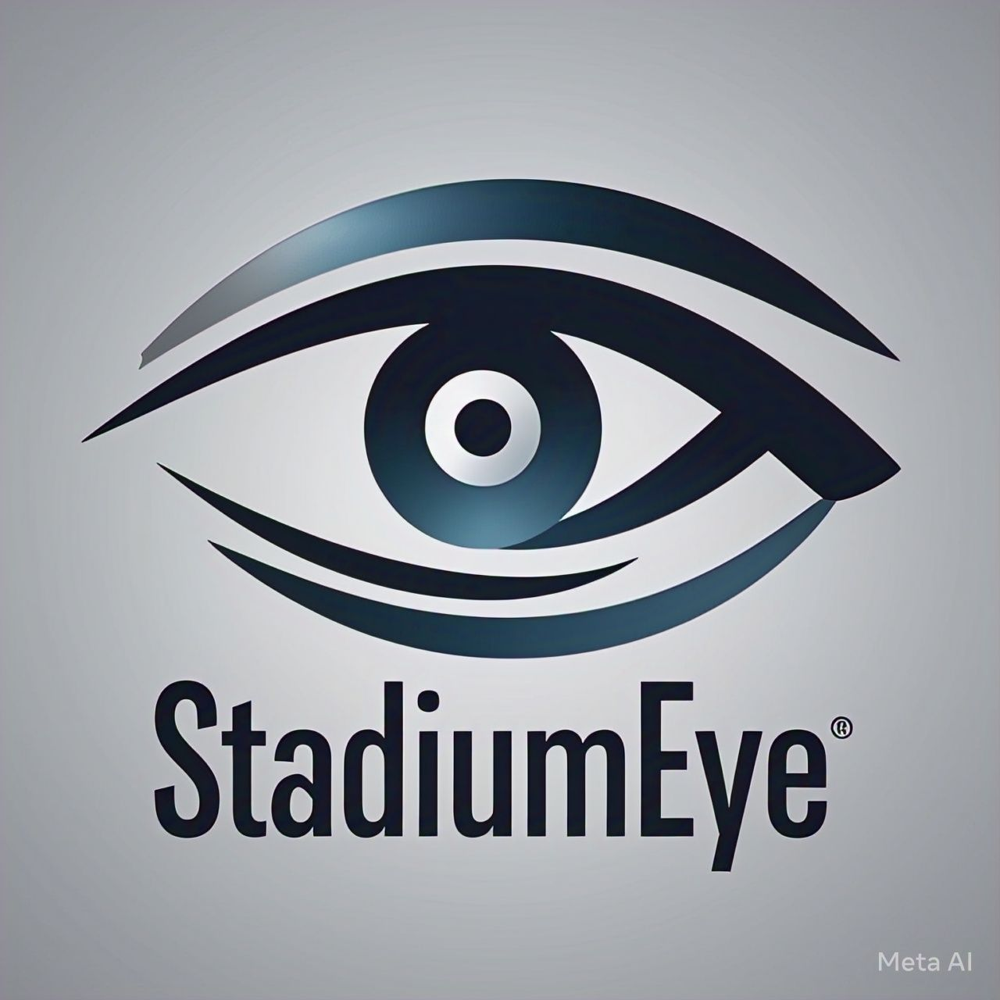

# Examen-Bimestral-2-Grupo-5
# 🎥 StadiumEye - Simulación de Cámaras para Estadios ⚽

## 🏟️ Descripción
**StadiumEye** es una herramienta innovadora diseñada para ayudar a profesionales del deporte y la producción audiovisual a visualizar, probar y optimizar la colocación de cámaras en estadios de fútbol. Nuestro software permite reducir costos operativos y mejorar la calidad de las transmisiones antes de realizar implementaciones físicas.

## 🎯 Misión
Proporcionar una herramienta innovadora y precisa que permita a los profesionales del deporte y la producción audiovisual visualizar, probar y optimizar la colocación de cámaras en estadios de fútbol, reduciendo costos operativos y mejorando la calidad de las transmisiones.

## 🚀 Visión
Ser la plataforma líder en simulación de cámaras para estadios, permitiendo a la industria deportiva optimizar costos y mejorar la experiencia audiovisual antes de realizar implementaciones físicas.

## Integrantes
- Brayan Ortiz
- Fabian Simbaña
- Elias Cazar
- Enrique Perez
